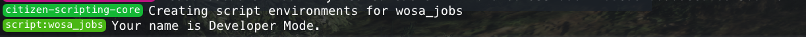

# Connector Examples
So, now that you got the connector setup in your own resource it is time to make your first wosa script! Here we have a few examples of how to create script in various forms.

### Basic Print
Let's see so everything is working as expected by doing a simple "what_is_my_name" print in console.

`client.lua`
```markdown
RegisterCommand('what_is_my_name', function()
    print('Your name is '..Wosa.Character.Firstname()..' '..Wosa.Character.Lastname()..'.')
end)
```

**Ok, press F8 and see if it did work!**

{: style="height:40%;width:40%"}

### Basic Menu
Add this to `fxmanifest.lua` file. By adding this to your manifest file you import the menu library required to create RageUI menus.

```Markdown
client_scripts {
    '@wosa_core/scripting/scripting_ex/RageUI/RMenu.lua',
    '@wosa_core/scripting/scripting_ex/RageUI/RageUI.lua',
    '@wosa_core/scripting/scripting_ex/RageUI/Menu.lua',
    '@wosa_core/scripting/scripting_ex/RageUI/MenuController.lua',

    '@wosa_core/scripting/scripting_ex/RageUI/components/Audio.lua',
    '@wosa_core/scripting/scripting_ex/RageUI/components/Rectangle.lua',
    '@wosa_core/scripting/scripting_ex/RageUI/components/Screen.lua',
    '@wosa_core/scripting/scripting_ex/RageUI/components/Sprite.lua',
    '@wosa_core/scripting/scripting_ex/RageUI/components/Text.lua',
    '@wosa_core/scripting/scripting_ex/RageUI/components/Visual.lua',

    '@wosa_core/scripting/scripting_ex/RageUI/elements/ItemsBadge.lua',
    '@wosa_core/scripting/scripting_ex/RageUI/elements/ItemsColour.lua',
    '@wosa_core/scripting/scripting_ex/RageUI/elements/PanelColour.lua',

	'@wosa_core/scripting/scripting_ex/RageUI/items/UIButton.lua',
    '@wosa_core/scripting/scripting_ex/RageUI/items/UICheckBox.lua',
    '@wosa_core/scripting/scripting_ex/RageUI/items/UISeparator.lua',
    '@wosa_core/scripting/scripting_ex/RageUI/items/UIList.lua',
    '@wosa_core/scripting/scripting_ex/RageUI/items/UIProgress.lua',
    '@wosa_core/scripting/scripting_ex/RageUI/items/UISlider.lua',
    '@wosa_core/scripting/scripting_ex/RageUI/items/UISliderHeritage.lua',
	'@wosa_core/scripting/scripting_ex/RageUI/items/UISliderProgress.lua',
	
	'@wosa_core/scripting/scripting_ex/RageUI/panels/UIBoutonPanel.lua',
	'@wosa_core/scripting/scripting_ex/RageUI/panels/UIColourPanel.lua',
    '@wosa_core/scripting/scripting_ex/RageUI/panels/UIGridPanel.lua',
    '@wosa_core/scripting/scripting_ex/RageUI/panels/UIGridPanelHorizontal.lua',
    '@wosa_core/scripting/scripting_ex/RageUI/panels/UIGridPanelVertical.lua',
    '@wosa_core/scripting/scripting_ex/RageUI/panels/UIPercentagePanel.lua',
    '@wosa_core/scripting/scripting_ex/RageUI/panels/UIStatisticsPanel.lua',

    '@wosa_core/scripting/scripting_ex/RageUI/windows/UIHeritage.lua',
}
```

`client.lua`, This will be the client file in your own resource which will "handle" the menu.
```Markdown

-- At top of file, we register the menu.
RMenu.Add('example', 'menu', RageUI.CreateMenu('', '', 1320, 0))
RMenu:Get('example', 'menu'):SetSubtitle('~b~EXAMPLE MENU')

-- Render handle, put inside a loop. "Wosa.Loop" is equal to a "while true do" loop.
Wosa.Loop(true, function()

    -- handle for menu, needs to be in a loop, handled in "real time".
    RageUI.IsVisible(RMenu:Get('example', 'menu'), false, false, true, function()
        RageUI.ButtonWithStyle('a button wow!', 'this is desc for the button, can be nil to be empty/nothing.', {  }, true, function(Hovered, Active, Selected)
        
        end)
    end)
end)

-- "/open_test_menu" to open the menu.
RegisterCommand('open_test_menu', function()
    RageUI.Visible(RMenu:Get('example', 'menu'), true)
end)
```

**Let's see how it looks! 🐌**

{: style="height:20%;width:40%"}