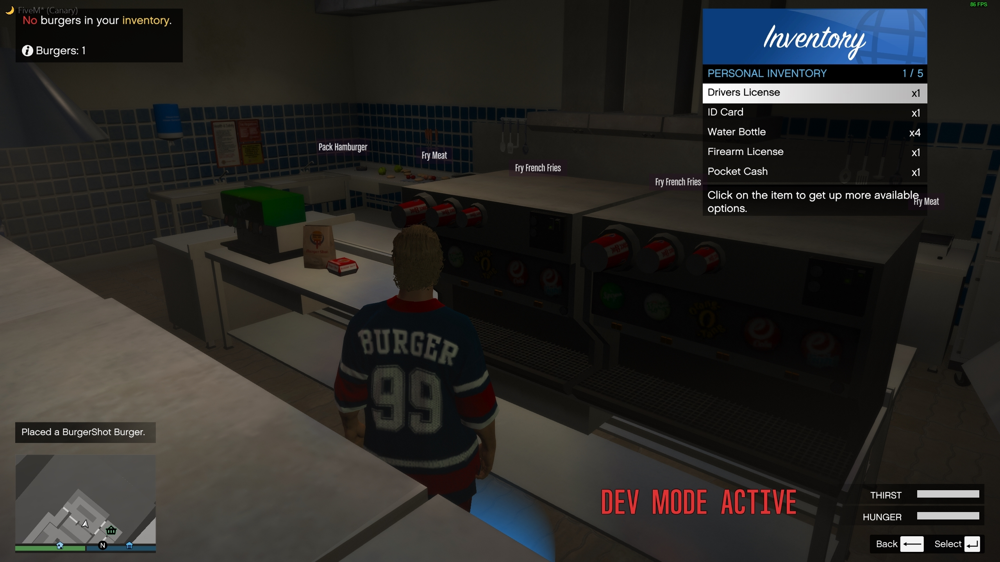
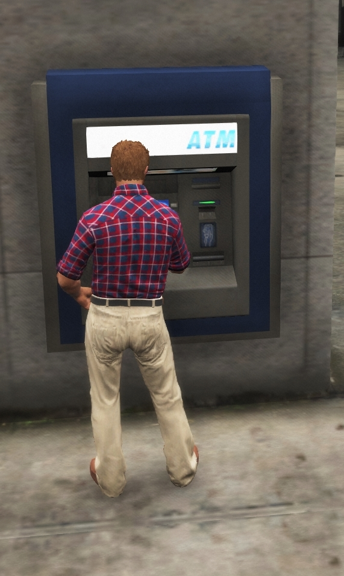

# Player Guide
So you just spawned in to a server with this framework installed and now feel pretty lost? Don't worry we will cover you with the basic and *most* important things.

### Spawning in
{: style="height:0%;width:20%"} {: style="height:0%;width:14%"}

Alright, So you have finished your character and is now standing at the airport wondering what to do. We recommend you to do the following...

- Check out your main menu, Press M *(defult)* to open it as you will spend ALOT of your time in here.
- Rent a **taxi** or a **bicycle** at the airport to get yourself into the town of Los Santos.
- When in the city, head to a store and purchase something to eat and drink as without health you won't get far.
- Now it is time to get into business, as from the beginning with no levels not all interactions are unlocked. We have a made a list for good starter jobs below were you can get some starter cash and levels from which requires no or little levels to play.

### Starter jobs
{: style="height:0%;width:40%"}

Looking for great jobs **without** any or **very little** level *required*? Take a look at our list we made for you!

- **BurgerShot job**, serve real players hamburgers and make them yourself! **[0 points required]**
- **Public Works**, do work for the state around the map. **[0 points required]**
- **Construction Works**, work on construction sites around Los Santos and earn money! **[0 points required]**
- **Garbage Trucker**, for this job, you are required to own a truck license and a vehicles driver license, **[20 points required]**

### Levels
{: style="height:0%;width:40%"}

Levels, points or "XP" as it is called is a system to make the experience more challenging and competitive. You can gain levels by completing daily tasks and by doing tasks such as jobs and winning races. You also gain *x* amount of points each half hour playing on the server. You can also *loose* points by dying or getting jailed for example.

**So what can you do with levels?** When you are starting out on the server you are pretty limited to what you can do. You can not purchase own vehicles from "official" stores which means you are forced to rent a vehicle or buy a custom vehicle from the auto-dealership or the business vehicle dealerships if you *DO* want a vehicle. Same goes for owning houses, the first "househould" you will be avaliable to own is a rented apartment where you can be safe. A lot of the jobs are locked to a lower or a higher level depending on the possible earnings you can receive from the job. Same goes for *legal firearms* that can be purchased of the Ammunation store. You can only purchase a firearm license after you reached x amount of points, Of course there is other ways to get a weapon, illegal firearms *cough*. By playing more on the server you earn more levels which will give you access to more interactions and give your character more status in the server community.

📌 ***FOR SERVER OWNERS:*** *This system can be disabled [here](https://github.com/WosaFramework/Framework/blob/master/wosa_core/scripting/scripting_configs/Beta_config.lua#L7) as it still marked as a BETA feature.*

### Money
{: style="height:0%;width:10%"} {: style="height:0%;width:25%"}

Money, the thing we all need. From the beginning you might not have as much money as some other people around. That is okay, Just be sure that you are handling your money in the correct way. Most important is as soon as possible buying a bank card from a bank anywhere in San Andreas in case you die or get robbed. Keeping all of your money in your pockets is a **BIG** no no. Keep a few dollars on your pocket cash for normal day to day business to be safe. To transfer, deposit or withdrawal from your bank card you can visit a bank or a ATM which is located around the map. To **view** the amount of **pocket cash** you have open your *menu -> inventory -> cash -> use item*.

### Licenses
{: style="height:0%;width:25%"} {: style="height:0%;width:25%"}

Oh, Licenses? Yes! You will need a license for certain things which are...

- Legal firearm
- Driver's license
- Trucking license
- Pilot license

After completing and purchasing the license you can showcase it to an officer in your inventory menu by hitting *use item* on your license item. Your license can be revoked by a police officer or in worst case by a speed camera due to excessive speeding. Soo... Don't speed like a crazy guy on drugs if you want to keep your license!